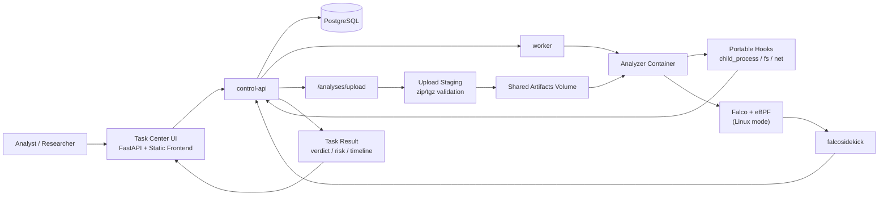

# npm-threat-observatory

一个面向 **npm 投毒检测（package poisoning）** 和 **供应链安全分析** 的本地 PoC 平台。

本项目聚焦 npm 包在 **安装期** 与 **运行期** 的高风险行为，例如：
- 生命周期脚本中的下载执行
- 可疑外联与 beacon 行为
- 敏感凭据读取
- 子进程 / shell 派生
- 上传恶意归档后的受控沙箱分析

当前仓库按 **Podman 优先，Docker 兼容** 的方式组织，系统支持上传归档、registry 包和本地样本三种分析来源，并提供两种检测模式：

- `portable`：适合 mac 本机，通过命令包装器和 Node hook 采集高风险行为
- `falco`：适合 Linux VM，通过 `Falco + modern eBPF` 获取更强的容器行为观测

## Why

很多 npm 供应链攻击并不是传统意义上的“漏洞利用”，而是通过：
- 恶意 `postinstall` / `preinstall` 脚本
- 被投毒的依赖包或 typosquatting 包
- 运行时偷偷外联、回传环境信息或窃取凭据
- 下载第二阶段 payload 再执行

这个项目的目标，就是把这些行为放进一个受控分析环境里，给出结构化的任务结果、事件时间线和风险结论。

## Components

- `control-api`: 提交分析任务、查询结果、接收 Falco webhook
- `worker`: 轮询待分析任务，拉起隔离分析容器执行安装期和运行期检查
- `analyzer`: Node.js 分析镜像，负责实际安装 npm 包和触发运行期加载
- `falco` / `falcosidekick`: Linux 模式下捕获容器行为并推送告警
- `verdaccio`: 本地 npm 代理
- `db`: 保存分析任务、容器映射、告警事件

## Architecture



这个架构的核心思想是：
- `control-api` 负责任务入口、事件归并和结果输出
- `worker` 负责拉起一次性 analyzer 容器
- 上传包先经过受控解包和校验，再以只读方式挂进 analyzer
- 行为事件来自两条链路：
  - `portable`：命令包装器 + Node hook
  - `falco`：Linux VM 下的内核级容器观测

## Detection Scope

当前 PoC 重点覆盖：
- npm 包投毒检测
- 安装期生命周期脚本行为分析
- 运行期外联与进程行为分析
- 上传归档的离线 / 最小联网沙箱检测
- Linux 场景下的 Falco/eBPF 容器观测

## Demo Walkthrough

下面这条演示链路适合给开源读者快速理解“这个项目到底能看到什么”：

### 1. 启动任务中心

```bash
export CONTROL_API_HOST_PORT=18000
podman compose build analyzer control-api worker
podman compose up -d
open http://localhost:18000
```

启动后你会看到：
- 左侧：任务列表
- 中间：任务结果、风险等级、时间线
- 右侧：新建任务，支持 `registry` / `sample` / `upload`

### 2. 跑一个 benign 基线任务

在页面中选择：
- `Source Type`: `Sample Template`
- `Sample`: `Benign Baseline`
- `Egress Policy`: `Offline`

预期结果：
- 状态会从 `queued -> running_install -> running_runtime -> completed`
- verdict 通常是 `clean`
- 时间线很少或没有高危事件

### 3. 跑一个安装期投毒样本

在页面中选择：
- `Source Type`: `Sample Template`
- `Sample`: `Malicious Postinstall`
- `Egress Policy`: `Offline`

预期结果：
- 任务会记录 shell / 网络 / 下载执行相关行为
- 因为是 `offline`，外联会被阻断并写入事件
- verdict 应趋向 `suspicious` 或 `malicious`

### 4. 上传一个本地恶意归档

在页面中选择：
- `Source Type`: `Upload Package`
- 选择一个 `.tgz` / `.zip`
- `Egress Policy`: `Offline` 或 `Registry Only`

预期差异：
- `offline`：适合高风险样本，重点看“尝试行为”和阻断记录
- `registry_only`：适合复现更真实的安装期依赖拉取，但仍会阻断非白名单公网访问

### 5. 结果页应该重点看什么

任务结果页重点看这几列信号：
- `source`: 这是 `registry`、`sample` 还是 `upload`
- `egress`: 这是离线检测结论还是最小联网结论
- `verdict`: `clean` / `suspicious` / `malicious` / `failed`
- `Matched Security Events`: 命中了哪些规则，发生在 install 还是 runtime
- `Execution Error`: 如果任务失败，会先显示执行错误而不是误报成 `clean`

## Quick Start

### 方式 1：mac 本机 + Podman（portable 模式）

1. 启动 Podman machine：

```bash
podman machine start
```

2. 查看 Podman machine 的 API socket。你这台机器当前默认连接名是 `podman-machine-default`，URI 是：

```text
ssh://core@127.0.0.1:54054/run/user/501/podman/podman.sock
```

通常还需要一个本地转发 socket，常见路径是：

```bash
~/.local/share/containers/podman/machine/podman.sock
```

3. 用 Podman Compose 启动 portable 模式，把宿主机 Podman socket 挂进容器：

```bash
export CONTAINER_SOCKET_PATH="$HOME/.local/share/containers/podman/machine/podman.sock"
export CONTROL_API_HOST_PORT=18000
podman compose build analyzer control-api worker
podman compose up -d
```

4. 查看健康状态，确认后端为 `portable`：

```bash
curl http://localhost:18000/health
```

### 方式 2：Linux VM（falco 模式）

1. 在 Linux VM 中安装 Podman 或 Docker，内核需支持 Falco modern eBPF。
2. 以 Falco profile 启动：

```bash
DETECTION_BACKEND=falco CONTAINER_SOCKET_PATH=/var/run/docker.sock podman compose --profile linux-falco build analyzer control-api worker
DETECTION_BACKEND=falco CONTAINER_SOCKET_PATH=/var/run/docker.sock podman compose --profile linux-falco up -d
```

如果 Linux VM 里用的是 Docker，也可以把上面的 `podman compose` 换成 `docker compose`。

### 提交一个 registry 分析任务

```bash
curl -X POST http://localhost:8000/analyses \
  -H 'Content-Type: application/json' \
  -d '{
    "package_name": "left-pad",
    "version": "1.3.0",
    "runtime_mode": "require"
  }'
```

如果你本机的 `8000`、`5432`、`4873` 或 `2801` 已被占用，可以在启动前覆盖这些环境变量：

```bash
export CONTROL_API_HOST_PORT=18000
export DB_HOST_PORT=15432
export VERDACCIO_HOST_PORT=14873
export FALCOSIDEKICK_HOST_PORT=12801
```

4. 查询任务与事件：

```bash
curl http://localhost:8000/analyses/<analysis_id>
curl http://localhost:8000/analyses/<analysis_id>/events
```

### 上传一个 npm 归档分析任务

```bash
curl -X POST http://localhost:18000/analyses/upload \
  -F file=@./package.tgz \
  -F runtime_mode=require \
  -F egress_mode=offline
```

## API

- `POST /analyses`
- `POST /analyses/upload`
- `GET /analyses/{id}`
- `GET /analyses/{id}/events`
- `GET /health`
- `POST /webhooks/falco`

## Notes

- `portable` 模式不依赖 Linux 内核能力，所以 mac 上也能演示安装期/运行期的高风险行为。
- `portable` 模式是 PoC 级降级检测，覆盖 shell 派生、可疑网络访问、敏感凭据路径访问、下载执行等高风险动作，但能力弱于内核级 Falco。
- 上传归档支持 `.tgz`、`.tar.gz`、`.zip`，默认会校验路径穿越、符号链接、文件数量和展开体积。
- 上传与 sample 任务默认 `offline`；registry 任务默认 `registry_only`，只允许访问 registry host。
- 当前 worker/control-api 仍通过 Docker-compatible API 驱动容器，所以无论底层是 Podman 还是 Docker，都需要把兼容 API socket 挂载到容器内的 `/var/run/docker.sock`。
- 在 mac 上如果 `podman info` 报无法连接，先执行 `podman machine start`，再重试 `podman system connection list` 和 `podman compose up`。
- `falco` 服务默认启用 `--modern-bpf`，要求 Linux VM 内核支持 modern eBPF。
- 如果 Linux 内核不支持 modern eBPF，需要把 `falco` 服务切换到 driver 模式。
- `samples/` 目录提供了本地恶意/正常样例，便于后续接入文件源分析或 Verdaccio uplink 验证。
